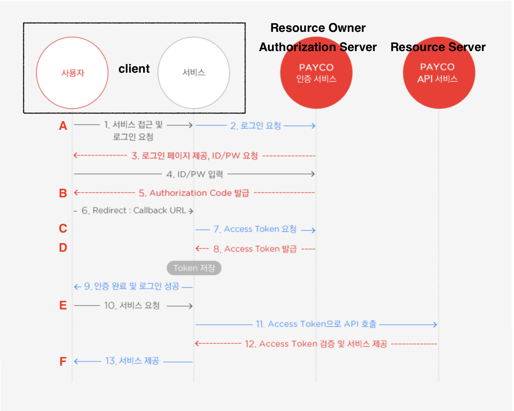

# 부스트 캠프 멤버십 19일차 

## week4 back-end day2

### 오늘 공부한거 

#### passport OAuth

passport 는 Node js의 authentication 미들웨어이다. 

대부분의 서비스는 인증와 리소스에 대한 권한 부여 기능이 필요하다. 위 기능을 다양한 방법으로 제공되고 있는데 대표적인 방법으로 OAuth 가 있다. 

>  요즘 네이버, 카카오, 페이스북, 구글로 로그인하기를 많이 볼 수있는데 이것은 `OAuth` 라는 기술이다. 
>
> web, mobile, desktop application에서 secure authorization을 할 수 있는 simple 하고 standard 한 method를 제공해주는 open protocol 이다. 
>
> OAuth library는 다양한 언어를 지원한다. 현재 버젼은 2.0이고 더 자세한 내용은 아래 링크에 있다.
>
> https://oauth.net/2/

#### OAuth를 이해하기 위한 좋은 예시

```
     +--------+                               +---------------+
     |        |--(A)- Authorization Request ->|   Resource    |
     |        |                               |     Owner     |
     |        |<-(B)-- Authorization Grant ---|   자원소유자     |
     |        |                               +---------------+
     |        |
     |        |                               +---------------+
     |        |--(C)-- Authorization Grant -->| Authorization |
     | Client |                               |     Server    |
     |        |<-(D)----- Access Token -------|    권한 서버		|
     |        |                               +---------------+
     |        |
     |        |                               +---------------+
     |        |--(E)----- Access Token ------>|    Resource   |
     |        |                               |     Server    |
     |        |<-(F)--- Protected Resource ---|    자원 서버    |
     +--------+                               +---------------+
```

- A : client 는 (자원 소유자에게 직접 또는 권한 서버를 거쳐 간접적)으로 권한 요청(Authorization Request)을 합니다.
- B : 자원 소유자가 권한을 허용하면 client 는 권한 증서(Authorization Grant)을 받습니다.
- 권한증서는 4가지 타입이 있다.
  - Authorization Code
  - Implicit
  - Resource Owner Password Credentials
  - Client Credentials
- C : 권한 증서를 받은 client 는 최종목표인 access token을 받기 위해 권한 서버에게 요청을 합니다. 
- D : 요청을 받은 권한 서버는 클라이언트를 보낸 권한 증서의 권한 증서를 확인합니다. 유효하다면 client에게 access token을 발급합니다. 
- E : 드디어 access token을 받은 client 는 자원 서버에 당당히 자원을 요청합니다.
- F : 자원 서버는 토큰을 확인하고 자원을 보내줍니다.

[출처: 내 맘대로 OAuth 2.0 정리!](http://blog.weirdx.io/post/39955)


#### PAYCO 해석해보기



[출처: 페이코 개발자센터 OAuth 2.0 프로세스](https://developers.payco.com/guide/development/start)


#### 결론

다양한 플랙폼 환경에서 권한부여를 위한 산업 표준 프로토콜이다. 

인증`Authentication`과 권한 `Authorization`을 획득한다.

인증은 시스템의 접근을 확인하는 것이다. ex) login

권한은 행위의 권리를 검증하는 것이다. 

### 오늘 개발한거 

passport 를 이용해 사용자 인증하기

#### before 

```javascript
router.post('/login', function(req, res, next){
  let id = req.body.id;
  let pwd = req.body.pwd;
  let db_query_result = db.select_userTable(id, pwd);
  
  if(db_query_result.state == true){
    const date = Date.now();
    db.insert_sessionTable(db_query_result.index, date);
    const session_id = db.select_sessionTable_index(db_query_result.index);

    res.cookie('SESSION_ID',  session_id,{
      maxAge : 10000
    })
    res.redirect('/');
  }else{
    res.redirect('/#login');
  }
})
```


#### After 

```javascript
passport.use(new LocalStrategy(
  function(username, password, done) {
    let sql = `SELECT * FROM ${DB.USER_TABLE} WHERE uID = '${username}'`;
    connection.query(sql, (err, rows) => {
      if (err) { return done(err); }
      if (!rows[0]) {
        return done(null, false , { message : 'Incorrect ID.'});
      }
      if(rows[0].uPwd == password){
        return done(null, rows[0]);
      }else{
        return done(null, false , { message : 'Incorrect PASSWORD. '});
      }
    });
  }
));
```

```javascript
router.post('/login',
passport.authenticate('local', { successRedirect: '/',
                                 failureRedirect: '/login',
                                 failureFlash: true })
);
```


### 오늘 느낀점 

인증과 권한 획득은 굉장히 중요하다. 좀 더 공부해봐야할것 같다.


