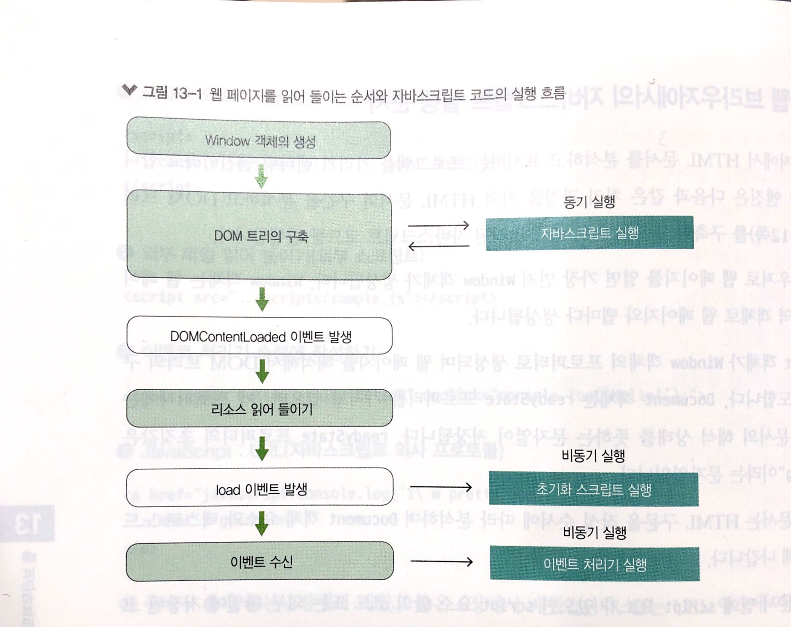

# 부스트 캠프 멤버십 22일차 

## week4 back-end day5

### 오늘 공부한거 

#### 웹 브라우저에서의 자바스트립트 실행 순서 

웹 브라우저에서 HTML 문서를 분석하고 표시하는 프로그램을 가리켜 **렌더링 엔진**이라고 한다. 렌더링 엔진은 다음과 같은 처리 과정을 거쳐 HTML 문서의 구문을 분석하고 DOM 트리를 구축한 후에 HTML 안에 지정된 자바스크립트 코드를 실행합니다. 

1. 웹 브라우저로 웹 페이지를 열면 가장 먼저 `Window` 객체가 생성된다. `Window` 객체는 웹 페이지의 전역 객체로 웹 페이지와 탭마다 생성된다.
2. `Document` 객체가 `Window` 객체의 프로퍼티로 생성되며 웹 페이지를 해석해서 `DOM` 트리의 구축을 시도한다. `Document` 객체는 `readyState` 프로퍼티를 가지고 있으며, 이 프로퍼티에는 HTML 문서의 해석 상태를 뜻하는 문자열이 저장된다. `readyState` 프로퍼티의 초기값은 **"loading"** 이라는 문자열이다.
3. HTML 문서는 HTML 구문을 작성 순서에 따라 분서하며 `Document` 객체 요소와 텍스트 노드를 추가해 나간다.
4. HTML 문성 안에 script 요소가 있으면 script 요소안의 코드 또는 외부 파일에 저장된 코드의 구문을 분석한다. 그 결과 오류가 발생하지 않으면 그 시점에 코드를 실행한다. **이때 script 요소는 동기적으로 실행된다.** 즉, script 요소의 구문을 분석해서 실행할 때는 HTML 문서의 구문 분석이 일시적으로 막히고, 자바스크립트 코드의 실행을 완료한 후에는 일시적으로 막혀 있었던 HTML 문서의 구문 분석을 재개한다. 
5. HTML 문서의 모든 내용을 읽은 후에 `DOM` 트리 구축을 완료하면 document.readyState 프로퍼티 값이 **"interactive"** 로 바뀐다.
6. 웹 브라우저는 `Document` 객체에 `DOM` 트리 구축 완료를 알리기 위해 `DOMContentLoaded` 이벤트를 발생시킨다.
7. img등의 요소가 이미지 파일 등의 외부 리소스를 읽어 들어야 한다면 이 시점에 읽어 들인다.
8. 모든 리소스를 읽어 들인 후에는 document.readyState 프로퍼티 값이 **"complete"** 로 바뀐다.마지막으로 웹 브라우저는 `Window` 객체를 상대로 `load` 이벤트를 발생시킨다.
9. 이 시점부터 다양한 이벤트(사용자 정의 이벤트, 네트워크 이벤트)를 수신하며, 이벤트가 발생하면 이벤트 처리기가 비동기로 호출된다.

### 오늘 개발한거 

### 오늘 느낀점 

웹 페이지를 사용자가 조작하거나 자바스크립트 코드로 DOM 트리나 스타일을 수정하면 렌더링 엔진은 그때마다 화면을 다시 렌더링한다. 렌더 트리를 다시 구성하고 다시 렌더링하는 처리는 일반적으로 시간이 많이 걸리는 작업니다. 따라서 이러한 처리가 자주 발생하면 렌더링이 원할하지 않을 가능성이 있다. 웹 브라우저는 이러한 상황을 피하기 위해 렌더링 처리 횟수를 가능한 줄이는 최적화 처리를 한다. 예를 들어 스타일의 수정 요청이 여러 번 반복되면 요청을 대기열에 모아 두고 마지막에 한꺼번에 처리한다.

