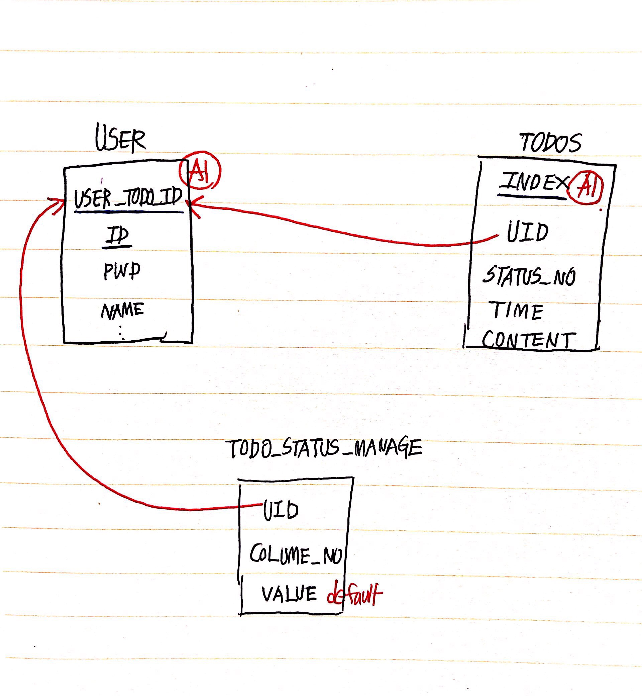

# 부스트 캠프 멤버십 23일차 

## week5 back-end day1

### 오늘 공부한거 

#### 조인은 왜 필요할까?

테이블 내에 저장된 서로 다른 투플들간의 관계를 파악하는데 사용된다.

 ex) 각 부서에 대하여 부서 이름과 관리자 이름의 쌍을 검색하라.


#### DB 설계를 위한 요구사항 분석

- 사용자는 한 개의 TODO를 가질 수 있다.

  - TODO의 COLUME은 일의 진행 `상태`를 나타낸다. 
  - TODO는 기본적으로 `todo`, `doing`, `done` 3개의 `COLUME VALUE` 을 가지고 있다.

- 사용자는 `COLUME VALUE` 의 값을 변경할 수 있다. 

- 사용자는 TODO의 COLUME 중 하나인 `todo` 에 `할 일 CARD` 를 추가 할 수 있다.

  - 가장 최근에 추가된 `할 일 CARD`가 최상위에 있다.

- 사용자는 TODO의 COLUME 중 하나인 `todo` 에 기존에 있던 `할 일 CARD` 를 삭제 할 수 있다.

- 사용자는 TODO의 COLUME 중 하나인 `todo` 에 기존에 있던 `할 일 CARD` 의 ` CONTENT`를 수정 할 수 있다.

-  `doing`, `done` COLUME의 추가, 삭제, 수정 요구사항은  위의 명시된 `todo` 의 추가, 삭제, 수정과 동일하다.

- 사용자는 TODO의 COLUME 중 하나인 `todo` 에 기존에 있던 `할 일 CARD` 의 상태를 변경할 수 있다.

  - todo` -> `doing`
  - `doing` -> `done`
  - `done` -> `doing`

  

#### 임시 DB 구성도



#### 임시 sql query 

```sql
SELECT * FROM test2.USER;

SELECT USER_TODO_ID FROM test2.USER U WHERE U.ID='abc1234';

/*사용자의 고유 TODO 식별자를 알아내 TODO_STATUS_MANAGE에서 각 COLUME들의 VALUE을 SELECT 함*/
SELECT * FROM test2.TODO_STATUS2 S WHERE S.UID=1; 
/*NOT USE '*'*/
SELECT VALUE FROM test2.TODO_STATUS2 S WHERE S.UID=1 ORDER BY CN ASC;

/*no join...*/
SELECT * FROM test2.TODOS T JOIN test2.TODO_STATUS2 S WHERE T.UID=S.UID AND T.STATUS_NO=S.CN AND T.UID=1;
SELECT * FROM test2.TODOS T JOIN test2.TODO_STATUS2 S WHERE T.UID=S.UID AND T.STATUS_NO=S.CN AND T.UID=1;

/*사용자의 고유 TODO 식별자를 알아내 TODOS에서 해당 사용자의 TODO card(상태번호, 시간, 내용)를 모두 SELECT 함*/
SELECT * FROM test2.TODOS T WHERE T.UID=1 ORDER BY T.STATUS_NO ASC, T.INDEX DESC;
SELECT STATUS_NO, TIME, CONTENT FROM test2.TODOS T WHERE T.UID=1 ORDER BY T.STATUS_NO ASC, T.INDEX DESC;

/*사용자 TODO의 COLUME 별 개수를 SELECT 함*/
SELECT COUNT(*) FROM test2.TODOS T WHERE T.UID=1 GROUP BY STATUS_NO ORDER BY STATUS_NO ASC;
```


### 오늘 개발한거 

x

### 오늘 느낀점 

DB 설계가 굉장히 어렵다. 왠지 join 같은 마법을 사용하지 않고 DB에 다 때려넣은 느낌이라 확신이 없다. 

사용자 별로 TODO가 있는데 이걸 어떤식으로 나눠야 할지 잘 모르겠다. 

- 사용자 별로 개인 TODO를 저장하는 Tables를 다 만들어 준다. (이건 아닌것 같다. 값이 너무 비싸다. USER_TODO_ID로 식별할 수 있을 것 같다.)
- 칼럼을 추가 삭제하지 않는다고 가정하고 칼럽1 Table, 칼럽2 Table, 칼럽3 Table을 따로 둔다. (이것 또한 아닌것같다. 그럼 한 사용자가 SELECT 문을 3번 요청해야하는 이상한 상황이 벌어진다.)
- 그래서 내린 결론은 마치 게시판글을 한데 다 모으듯이 모든 유저의 TODO를 다 모았다. 유저별로 식별할 수 있는 USER_TODO_ID 고유값을 이용해 적절히 WHERE 조건문을 걸어줬다. 
- 하지만 이렇게 설계하면 TODO가 많이 지면 많이질수록 성능이 떨어진다는것이다. log(N)이니깐 그래서 확신이 없다는것이다.
- 어렵다.