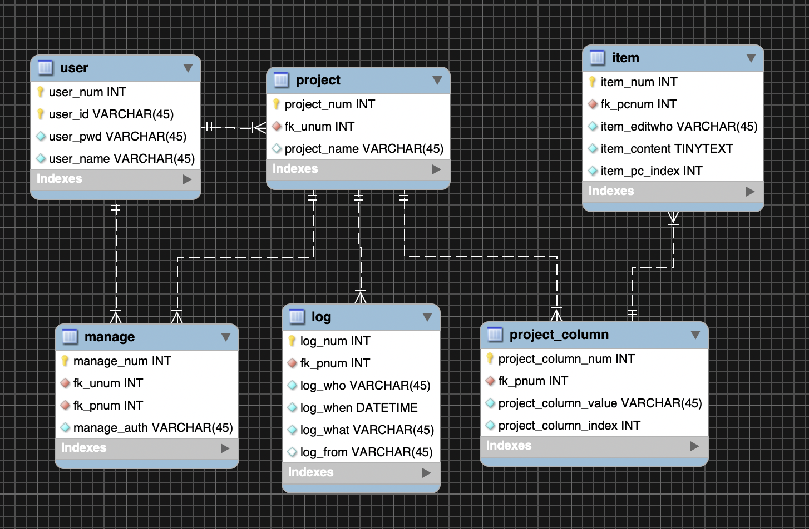

# 부스트 캠프 멤버십 24일차 

## week5 back-end day2

### 오늘 공부한거 

#### ER 다이어그램 그리기



ER 모델을 사용한 데이터 모델링에 대해 알아봤다. 데이터 베이스의 요구사항은 23일차에 분석했었다. 하지만, 요구사항이 한가득 늘어났다.

- user는 project 를 여러개 가질 수 있다. (기존에는 1개만 가능하다고 했었다.)

- project는 여러명의 user를 가질 수 있다. (OWNER 사용자, READ 사용자, WRITE 사용자등)
  
  - 위 2가지의 `user`,` project`의 관계의 카디날리티 비율은 M:N이기 때문에 `manage` 라는 별도의 table 을 생성해 관리했다. 
  
  
  
- 각 project는 item을 가질 수도 있고 없을 수도 있다 고유한 item을 가지고 있고 다른 project와 공유하지 않는다.

- `project`의 project_name 값은 OWNER 사용자만 수정가능하다.

- `project`의 project_column 값은 OWNER 사용자만 수정가능하다.

- `projec`t의 item은 OWNER, WRITE 사용자에 듸애 생성, 수정, 삭제가 가능하다.

- `log` 는 project 마다 따로 식별해서 관리된다. 

workbench를 이용해 ER 다이어그램을 그렸다. 이 그림대로 테이블을 생성해주는 마법이 있다. 상단 `Database` 탭을 클릭하고 `Forward Engineer..` 을 클릭하면 알아서 sql 문을 자동으로 작성해준다. 아래는 `user` 테이블을 생성하는 sql문 이다. 

```mysql
-- -----------------------------------------------------
-- Table `boostcamp-todo`.`user`
-- -----------------------------------------------------
CREATE TABLE IF NOT EXISTS `boostcamp-todo`.`user` (
  `user_num` INT NOT NULL AUTO_INCREMENT,
  `user_id` VARCHAR(45) CHARACTER SET 'utf8' NOT NULL,
  `user_pwd` VARCHAR(45) CHARACTER SET 'utf8' NOT NULL,
  `user_name` VARCHAR(45) CHARACTER SET 'utf8' NOT NULL,
  PRIMARY KEY (`user_num`, `user_id`))
ENGINE = InnoDB;
```


#### ER 다이어그램에서 사용하는 용어를 정리해보겠다.

**개체** : 실세게에서 독립적으로 존재하는 실체 

>  ex) e1,e2,e3 (개체타입 Employee)


애트리뷰트** : 각 개체를 설명해 주는 공유의 특성 

>  ex) age, SSN, salary

**애트리뷰트 타입** 

- 구분 1 : 단순 혹은 원자 애트리뷰트 vs 복합 애트리뷰트


- 구분 2 : 단일값 애트리뷰트 vs 다치 애트리뷰트 
- 구분 3 : 저장된 애트리뷰트 vs 유도된 애트리뷰트

**개체 타입** 

- 동일한 애트리뷰트들을 가지는 개체들의 집합을 기술
- 이름과 애트리뷰트들의 리스트로 표현
- 스키마 혹은 내포를 의미


**키 애트리뷰트** 

- 각 개체마다 서로 다른 값을 갖도록 제한된 유일한 애트리뷰트
- 동일한 개체 차입에 속하는 각 개체를 유일하게 식별하는데 사용


#### 관계의 기본 개념

**관계 인스턴스** : 개체 타입에 속하는 개체들 간의 연관성을 표현한 것

**관계 타입** : 동일한 형태의 관계 인스턴스들의 집함을 기술한 것

아래 그림에서 줄 하나하나가 relation instance이다.


#### 관계 타입에서의 제약 조건

**카디날리치 비율 제약 조건**

- 개체가 참여할 수 있는 관계 인스턴스들의 수
- 이진 관계 타입에 대한 카디날리티 비율은 1:1, 1:N, M:N 세 가지가 존재
- 1:1 예시 : 한 부서에는 한 명의 매니저가 있다. 
- 1:N 예시 : 한 부서에는 여러명의 사원들이 일을 하고 있다. 
- M:N 예시 : 사원 한명은 여러 프로젝트에 참여할 수 있다. 한 프로젝트는 여러명의 사원들이 참여하고 있다.

 

### 오늘 개발한거 

x

### 오늘 느낀점 

- DB설계를 차근차근하니 좋았다. 스캔 해야겠다. DB pdf를 다시 보는데 기억이 새록새록하다. 
- 이제 백엔드 API를 구현해보자!


