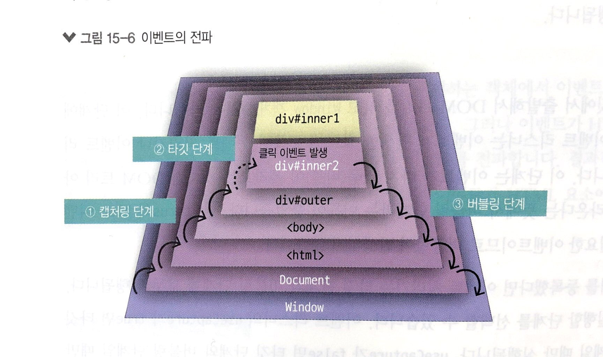

# 부스트 캠프 멤버십 29일차 

## week6 front-end day4

### 오늘 공부한거 

이벤트의 단계

이벤트가 발생한 요소는 이벤트 타깃, 이벤트를 발생시키는 것을 이벤트를 발사한다고 표현하기도 함

요소에서 이벤트가 발생하면 그다음 단계에 접어들었을 때 그 이벤트를 다음 요소로 전파한다. 그 단계에 해당 이벤트에 반응하는 이벤트 처리기나 이벤트 이스너를 발견하면 그들을 실행한다.

1. 캡처링 단계 : 이벤트가 `Window` 객체에서 출발해서 DOM트리를 타고 이벤트 타깃까지 전파된다. 이 단계에 반응하도록 등록된 이벤트 이스너는 이벤트가 발생한 요소에 등록된 이벤트 처리기나 이벤트 리스너보다 **먼저** 실행된다. 
2. 타깃 단계 : 이벤트가 이벤트 타깃에 전파되는 단계이다. 이벤트 타깃에 등록된 이벤트 처리기나 이벤트 리스너는 이 시점에 실행된다.
3. 버블링 단계 : 이벤트가 이벤트 타깃에서 출발해서 DOM트리를 타고 `Window` 객체까지 전파된다. 이 단계에 반응하도록 등록된 이벤트 리스너는 이벤트가 발생한 요소에 등록된 이벤트 처리기나 이벤트 이스너 다음에 실행된다. 이 단계는 이벤트가 마치 거품이 올라오는 것처럼 DOM 트리 아래에서부터 위로 올라온다는 뜻에서 버블링 단계라는 이름이 붙었다. 단, focus와 blur 이벤트는 그 요소에만 필요한 이벤트이므로 버블링이 발생하지 않는다. 이벤트 리스너의 useCapture가 true면 타깃 단계와 캡처링 단계일 때만 실행된다. false면 타깃 단계와 버블링 단계일 때만 실행된다. 




#### 이벤트 전파 취소하기 

```javascript
event.stopPropagation();
```

#### 이벤트 전파의 일시 정지

```
event.stopImmediatePropagation();
```

#### 기본 동작 취소하기

```
evnet.preventDefault();
```

예를 들어 a 요소를 클릭하면 링크된 페이지로 이동한다. 이처럼 웹 브라우저에 구현된 기본 동작을 취소하려면 preventDeafult() 메서드를 사용한다. 

### 오늘 개발한거 

### 오늘 느낀점 

자 이제 observer를 해볼까!


