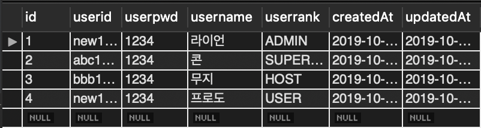

# 부스트 캠프 멤버십 31일차 

## week7 back-end day2

### 오늘 공부한거 

#### Sequlize migration

what is migration : https://sequelize.org/master/manual/migrations.html

요약하자면, Git/SVN처럼 database를 구축하는 (schema 설정, table 설정, column 설정 등등 전반적인 뼈대 코드)의 version을 관리하자는 소리이다. 

#### install

```shell
$ npm install --save sequelize
$ npm install --save mysql2
$ npm install --save sequelize-cli
```

#### init

```shell
$ npx sequelize-cli init
```

4개의 폴더가 생긴다.

- `config`, database 연결에 필요한 host, name, password등이 정의되어 있다.
- `models`, 모든 model들이 정의 되어 있다. index.js가 굉장히 중요한 일을 한다. config 파일을 사용한다. 
- `migrations`, 모든 migration 파일이 저장되어 있다. version 관리할때 사용하는 파일이다. (up, donw), (migrate, undo) 개념이 있다.
- `seeders`, 모든 seed 파일이 저장되어 있다. 더미 데이터를 넣을때 사용한다. (up, down), (migrate, undo) 개념이 있다.

config 의 내용을 적절히 수정한다.

dotenv를 설치해 .env 파일을 만들었다.

```
DB_USER=xxxxxx
DB_PASS=xxxxxxx
DB_SCHEMA=xxxxxxx
DB_HOST=xxx.xxx.xxx.xx
PORT=3000
NODE_ENV=development
```

config.json 을 config.js로 변경했다. 

```javascript
require('dotenv').config();
module.exports = 
{
  "development": {
    "username": process.env.DB_USER,
    "password": process.env.DB_PASS,
    "database": process.env.DB_SCHEMA,
    "host": process.env.DB_HOST,
    "dialect": "mysql",
    "operatorsAliases": false
  },
  ...
```

#### Create model

```shell
$ npx sequelize-cli model:generate --name User --attributes firstName:string,lastName:string,email:string
```

위 명령어를 입력하면 `models` 폴더에 user.js 파일과 `migrations` 폴더에 xxxxxxxxxx-create-user.js 파일이 생성된다. 

CLI 명령어 한줄로 모든 컬럼의 속성값들을 지정하는데에 한계가 있다. 그러므로 이런식으로 틀을 만든다음에 적절히 수정해준다. 나는 user 라는 테이블을 만들것이고 아래와 같은 칼럼을 가진다.

```javascript
// models/user.js
'use strict';
module.exports = (sequelize, DataTypes) => {
  const User = sequelize.define('User', {
    userid: { type: DataTypes.STRING, allowNull: false },
    userpwd: { type: DataTypes.STRING, allowNull: false },
    username: { type: DataTypes.STRING, allowNull: false },
    userrank: { type: DataTypes.STRING, allowNull: false, defaultValue: 'USER' }
  }, {});
  ...
    return User;
};
```

```javascript
// models/xxxxxxxxxx-create-user.js
'use strict';
module.exports = {
  up: (queryInterface, Sequelize) => {
    return queryInterface.createTable('Users', {
      id: {
        autoIncrement: true,
        primaryKey: true,
        type: Sequelize.INTEGER,
        allowNull: false
      },
      userid: { 
        primaryKey: true,
        type: Sequelize.STRING, 
        allowNull: false 
      },
      ...
     });
  },
  down: (queryInterface, Sequelize) => {
    return queryInterface.dropTable('User');
  }
};
```

#### Running migration

```shell
$ npx sequelize-cli db:migrate
```

```shell
❯ npx sequelize-cli db:migrate

Sequelize CLI [Node: 10.15.3, CLI: 5.5.1, ORM: 5.19.6]

Loaded configuration file "config/config.js".
Using environment "development".
(node:71092) [SEQUELIZE0004] DeprecationWarning: A boolean value was passed to options.operatorsAliases. This is a no-op with v5 and should be removed.
== 20191015083808-create-user: migrating =======
== 20191015083808-create-user: migrated (4.986s)
```

오 됐다!!!

만약 수정할게 생겼다면 가장 최근에 migrate 하기 전으로 돌아가 수정하고 다시 migrate를 한다. 

migrate를 하고 수정하고 또 migrate를 하면 schema의 변경사항이 없어서 database를 업데이트하지 않겠다고 뜬다. (뭔가 불편하다. 끙...)

```shell
No migrations were executed, database schema was already up to date.
```

```shell
$ npx sequelize-cli db:migrate:undo
$ npx sequelize-cli db:migrate
```

#### Creating First Seed

테이블을 생성했다. 이제 데이터를 넣어보자. 이것조차도 version 관리가 가능하다. 신기하다.

```shell
$ npx sequelize-cli seed:generate --name demo-user
```

`seeders` 폴더에 xxxxxxxxxx-demo-user.js 파일이 만들어진다.

```javascript
// seeders/xxxxxxxxxx-demo-user.js
'use strict';
module.exports = {
  up: (queryInterface, Sequelize) => {
    return queryInterface.bulkInsert('User', [{
      userid: 'new1234',
      userpwd: '1234',
      username: '라이언',
      userrank: 'ADMIN',
      createdAt: new Date(),
      updatedAt: new Date()
    }, 
    ...
    ], {});
  };
  down: (queryInterface, Sequelize) => {
    return queryInterface.bulkDelete('User', null, {});
  }
};
```

#### Running & Undo Seeds

```shell
$ npx sequelize-cli db:seed:all
$ npx sequelize-cli db:seed:undo
```

### 오늘 개발한거 




### 오늘 느낀점 

아아앙 너무 어렵다. 아러ㅏㅇ 다 하고 나니깐 아 그렇구나 쉽네하지 여기까지 오는데 너무 힘들었다. 
