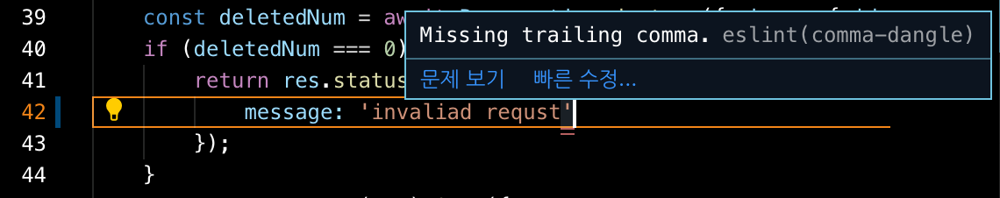

# 부스트 캠프 멤버십 34일차 

## week7 back-end day5

### 오늘 공부한거 

#### 403 error 란

요청한 페이지 또는 자원이 특정 이유로 인해 접근할 수 없는 상태를 말한다.

Forbidden: 이 디렉터리 또는 페이지를 볼 수 있는 권한이 없습니다. 로그인을 성공해서 일반 사용자로 인증은 받았지만, 해당 리소스에 접근할 수 없다면 403 에러가 적절할것 같다.

말그대로 차단이다. 예를 들어 일반 사용자가 관리자 페이지로 접근한다면 서버는 현재 접근한 사람이 누구인지 판단 후 관리자면 res.status(200).json(user.list) 관리자가 아닌 모든 유저들은 res.stats(403).json( { message: '접근권한이 없습니다.'}) 응답하는것이다.

#### 401 error 란

만약 아이디든 비밀번호든 잘못쳐서 jwt인증에 실패했다면 401 에러가 적절할것 같다.

서버는 로그인이 필요한 페이지에 대해 이 요청을 제공할 수 있다. 상태 코드 이름이 권한 없음(Unauthorized)으로 되어 있지만 실제 뜻은 인증 안됨(Unauthenticated)에 더 가깝다

### 오늘 개발한거 



```javascript
// .eslinrc.js
module.exports = {
  env: {
    ...
  },
  extends: "airbnb-base",
  globals: {
    ...
  },
  parserOptions: {
    ...
  },
  rules: {
		...
  }
};

```

에어비앤비코드 스타일을 참조하고 있다. 

Missing trailing comma. 오류를 만났는데 오브젝트의 마지막 속성: 값 뒤에 항상 `,` 를 붙이라고한다.

```javascript
// error
res.status(401).json({
    success: false,
    message: error.message
});

// ok
res.status(401).json({
    success: false,
    message: error.message,
});
```

왜 굳이 붙이나 궁금했는데 호눅스 마스터님이 알려주셨다.

**"한 개의 속성을 더 추가해보세요"**

헐, 2개의 줄이 수정되느냐 1개의 줄이 수정되느냐.... 매우 큰 차이였다. 대박!

### 오늘 느낀점 

사용자가 삭제할 권한이 있는건 맞는데 음,,, 이미 삭제되서 삭제할게 없을때는 무슨 stats code 를 보내야 하는가?

```javascript
/**
 * POST /api/reservation/cancel
 * get reservation info from form and cancel it
 * can cancel only writer
 */
exports.reservationCancel = async (req, res, next) => {
    const requestUser = req.decoded.id;
    const { UserId, id } = req.body;

    if (requestUser !== UserId) {
      // 인증은 했으나 자신이 만든 reservation이 아니므로 삭제 권한이 없다.
        return res.status(403).json({
            message: 'you dont have authority to cancel this reservation.',
        });
    }
    const deletedNum = await Reservation.destroy({ where: { id } });
    if (deletedNum === 0) {
      	// 이미 삭제됐는데 사용자가 또 요청할 경우는 무슨 status code 인가????
      	return res.status(403).json({
            message: 'invaliad requst',
        });
    }
  	// 정상적으로 삭제 완료 됨
    return res.status(200).json({
        message: 'deleted well',
    });
};
```


